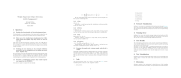
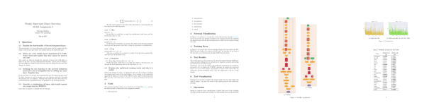
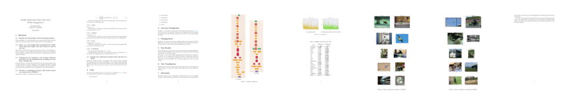

# pdf2thumb

This is a little Python program which extracts a thumbnail view from a given pdf file. You can select the  number of pages to be displayed. Hope this helps other to display their papers in their sites.


## Requirements

### ImageMagick

This program is just a shell of calling procedures for **ImageMagick** which is the package that does all the magick (o.O?). 

The installation instructions can be found [here](https://www.imagemagick.org/script/binary-releases.php).


## Usage example

It is fairly easy to use, you only need to give the pdf path, where the thumbnail will be stored and optionally the number of pages:

#### 3 pages

```
./pdf2thumb.py demo/report.pdf demo/report_3.png 3
```



#### 5 pages

```
./pdf2thumb.py demo/report.pdf demo/report_5.png 5
```



#### All pages

```
./pdf2thumb.py demo/report.pdf demo/report_all.png
```

